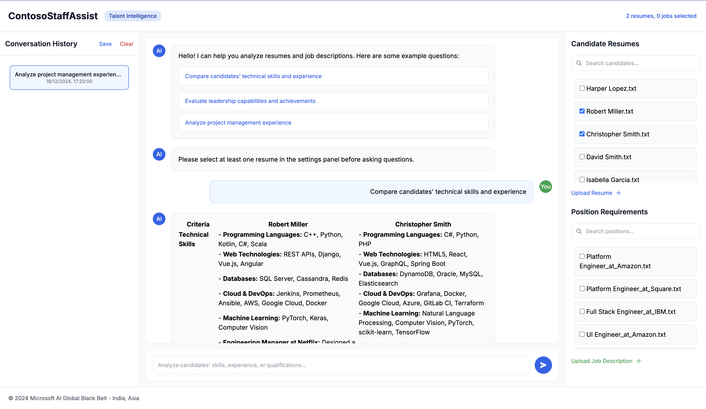

# StaffAssist

## TL;DR
StaffAssist is an AI-powered HR tool that helps you analyze resumes using natural language questions. Just upload resumes, ask questions in plain English (like "Compare candidates' leadership experience"), and get detailed insights backed by evidence from the resumes. Built with Azure OpenAI and FastAPI.

## 📸 Screenshots

*Main interface showing resume analysis in action*

## 🚀 Overview

StaffAssist is a powerful web application that leverages Azure OpenAI's Assistant API to analyze resumes and provide detailed candidate evaluations. The application enables HR professionals and recruiters to perform in-depth analysis of candidate profiles using natural language queries.

## ✨ Features

- **Interactive Web Interface**: Clean, modern UI built with FastAPI and Tailwind CSS
- **Natural Language Queries**: Ask questions about candidates in plain English
- **Real-time Analysis**: Get instant, AI-powered insights about candidates
- **Comparative Analysis**: Compare multiple candidates across various dimensions
- **Evidence-based Responses**: All analyses include citations from source resumes
- **Stream Processing**: Asynchronous response handling for better performance
- **Sample Data**: Includes demo resumes for immediate testing

## 🛠️ Technical Stack

- **Backend**: FastAPI, Python 3.8+
- **AI/ML**: Azure OpenAI Assistant API, Semantic Kernel
- **Frontend**: HTML5, Tailwind CSS, JavaScript
- **Template Engine**: Jinja2
- **Development**: Uvicorn (ASGI server)

## 📋 Prerequisites

- Python 3.8 or higher
- Azure OpenAI resource with Assistant API access
- Azure subscription
- Basic knowledge of Python and web development

## 🔧 Installation

1. **Clone the Repository**
   ```bash
   git clone https://github.com/yourusername/staffassist.git
   cd staffassist
   ```

2. **Create Virtual Environment**
   ```bash
   python -m venv venv
   source venv/bin/activate  # On Windows: venv\Scripts\activate
   ```

3. **Install Dependencies**
   ```bash
   pip install -r requirements.txt
   ```

4. **Set Up Environment Variables**
   Create a `.env` file in the project root:
   ```env
   AZURE_OPENAI_API_KEY=your_api_key
   AZURE_OPENAI_ENDPOINT=your_endpoint
   AZURE_OPENAI_CHAT_COMPLETION_DEPLOYED_MODEL_NAME=your_deployment_name
   ```

5. **Create Required Directories**
   ```bash
   mkdir templates
   mkdir resumes
   ```

6. **Copy Template Files**
   - Copy the provided `index.html` to the `templates` directory
   - Sample resumes will be automatically created in the `resumes` directory

## 🚀 Running the Application

1. **Start the Server**
   ```bash
   python main.py
   ```

2. **Access the Application**
   - Open your browser and navigate to `http://localhost:8000`
   - The application will be ready to use

## 💡 Usage Examples

Here are some example queries you can try:

1. **Technical Competency Analysis**
   ```
   Create a technical competency matrix for both candidates focusing on: AI/ML expertise, cloud infrastructure, and leadership.
   ```

2. **Project Experience**
   ```
   What are the most recent and relevant projects each candidate has led? Include team sizes and outcomes.
   ```

3. **Deployment Experience**
   ```
   Compare both candidates' experience with ML systems deployment and provide evidence of successful implementations.
   ```

4. **Comprehensive Evaluation**
   ```
   Create a final recommendation table with: top 3 strengths, growth areas, and risk factors for each candidate.
   ```

## 📁 Project Structure

```
staffassist/
├── main.py                 # Main application file
├── requirements.txt        # Project dependencies
├── .env                   # Environment variables
├── templates/
│   └── index.html        # Web interface template
├── resumes/              # Resume storage directory
│   ├── john_doe.txt
│   └── jane_smith.txt
└── README.md             # Project documentation
```

## 🔍 Key Components

### ResumeManager
- Handles resume file operations
- Manages sample resume data
- Provides file path utilities

### AssistantManager
- Manages Azure OpenAI Assistant configuration
- Handles chat thread creation and management
- Processes analysis requests
- Manages response streaming

### FastAPI Application
- Provides REST API endpoints
- Handles web interface rendering
- Manages asynchronous operations

## ⚙️ Configuration Options

The application can be configured through environment variables:

```env
AZURE_OPENAI_API_KEY=your_api_key
AZURE_OPENAI_ENDPOINT=your_endpoint
AZURE_OPENAI_CHAT_COMPLETION_DEPLOYED_MODEL_NAME=your_deployment_name
```

Additional configuration options in `main.py`:
- `temperature`: Controls response creativity (0.0 - 1.0)
- `base_directory`: Location for resume storage
- Server host and port settings

## 🔒 Security Considerations

1. **API Key Protection**
   - Never commit `.env` file
   - Use secure key management in production

2. **File Access**
   - Implement proper file access controls
   - Validate file types and content

3. **Input Validation**
   - Sanitize user inputs
   - Implement rate limiting

## 🚀 Deployment

For production deployment:

1. **Environment Setup**
   - Use production-grade ASGI server
   - Configure proper logging
   - Set up monitoring

2. **Security**
   - Enable HTTPS
   - Implement authentication
   - Set up proper CORS policies

3. **Performance**
   - Configure proper worker count
   - Implement caching if needed
   - Set up load balancing

## 🤝 Contributing

1. Fork the repository
2. Create your feature branch
3. Commit your changes
4. Push to the branch
5. Create a Pull Request

## 📝 License

This project is licensed under the MIT License - see the LICENSE file for details.